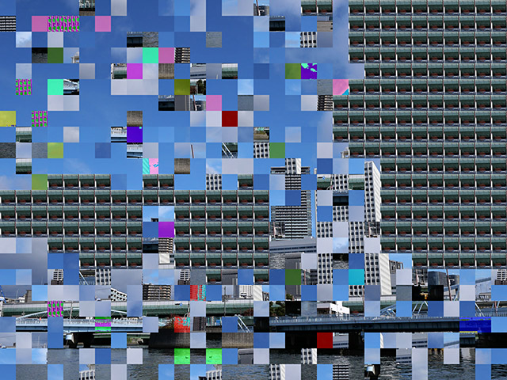
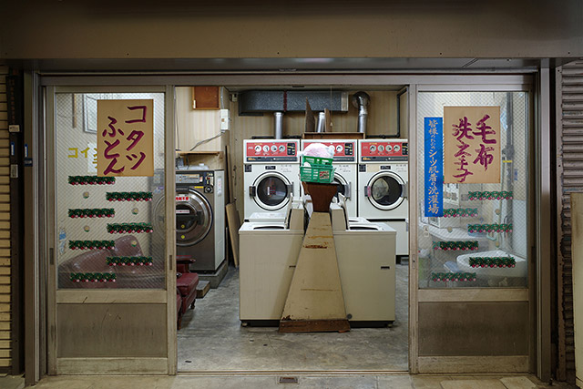
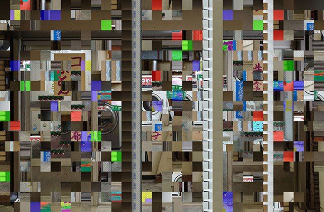
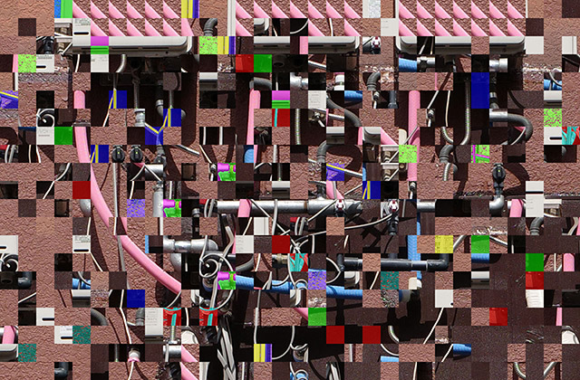

# fc_bug

This is a script that creates a buggy photo like NES (Family Computer).

## Samples
input image:


output image:



input image:



output image:



input image:


output image:



## Usage

```$ python fc_bug.py [file_name or directory_name]```

If you put a directory's name, all images in the directory will be processed at once.
